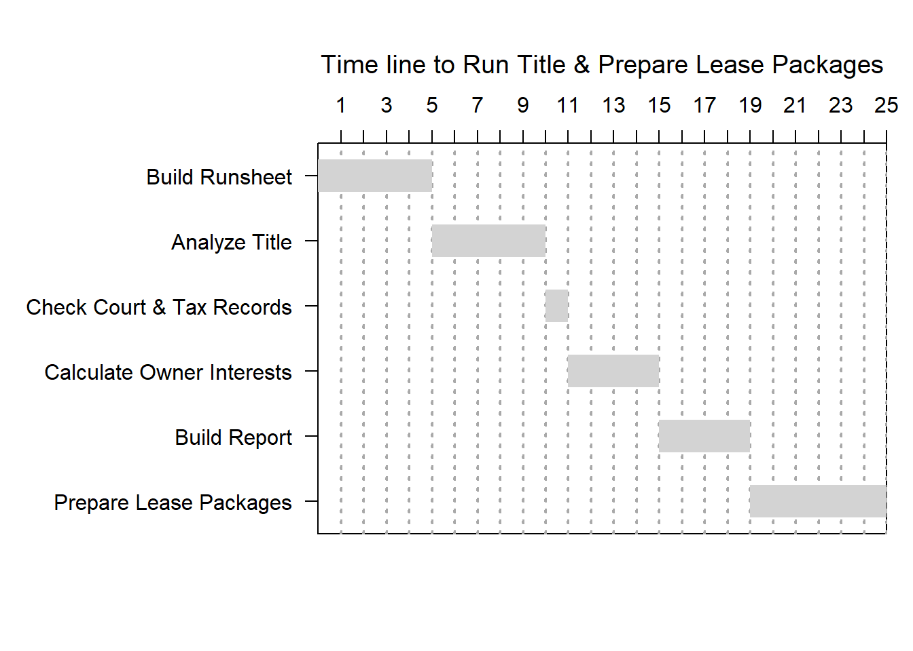

# Implications for Reproducible Reporting 

In the world of scientific research, the purpose of data analysis is to make the data analysis as open and transparent as possible to be able to exactly reproduce any of the results that were produced by it [@andrewsChapterReproducibleData]. 

The data analysis pipeline used by scientific researchers is analagous to the process of analyzing land title ownership.  Title analysis begins with acquiring title information from public records, documenting the title chain, reading the title chain and interpreting the chain of ownership and reducing the ownership into numerical quantities.  Mineral titles often have many owners with multiple classes of ownership, from royalty interests, production interests, mineral interests, term interests, life estate and remainder interests, severed or interests in both surface and mineral estates.  These interests are commonly referred to the "bundle of sticks," meaning, there are many classes of ownership in the mineral and surface estates.  A title report analyzes these interests in the form of fractional ownership.  Periods of ownership are important as well.  In Nebraska, for example, an owner who has not documented a claim or had a transfer of interest in his severed mineral estate for a period of 23 years, is subject to claims of abandonment of the mineral interest by the surface owner.  The individual owners interest must be compiled into an ownership report together with the contact information for each owner.  Claims, such as *Lis Pendens*, delinquent taxes, pending County and District Court suits must be documented when reporting the status of the title for each owner.  

## The Hypothetical Title Report  

Ownership reports are commonly lengthy and contain a lot of data depending on the complexity of the title. Geographical areas where there is mineral production, the title can expected to be more complex and more time consuming to complete.

Creating title reports, like scientific research, is a multi-step process.  The Gantt chart below outlines a hypothetical number of days that it could take for each step in the process of compiling ownerhship reports.  

It is impossible, without reams of data, to provide cost estimates in dollar amounts that could be saved by using reproducible reporting.  The cost of examining and reporting title ownership is just too varied to make any sense.  However, time savings can be estimated by analyzing each step in the analyis as a percentage of time it takes to complete the process.  In the example below, I estimate the time in days to create a hypothetical title report covering complex mineral title.  The proportion of time spent on each step of the process will remain fairly constant and therefore, can be a reliable predictor in percentage of time/cost that can be saved. The more complex your title issues, the greater the savings.   

The Gantt chart lists six steps for the preparation of an ownership report and preparation of lease packages.  I have had some mineral titles that had as few as one owner and as many as 350 owners.  Some titles may take a week or less to analyze, others may take a month or more.  One never knows what title issues one will encounter, or how complex a title can be until one actually examines the title.  The number of days chosen in the example below is simply a hypothetical case for illustration.  What remain constant is, the time it takes to complete the first four steps is relative to the time it takes to complete steps 5 and six.  That is, the number of days it takes to build the runsheet, analyize the title, and calculate the owners' interests, is equally proportional to the number of days it takes to build the report and prepare lease packages.

If, for example, one needs 15 days to get through calculating the owners' interests, one will need nearly that many days to build the report and prepare the lease packages.  This is where reproducible reporting becomes an advantage.  
Using the techniques of reproducible reporting, the time required for building the reports and preparing the lease packages is reduced from days to usually *seconds*.  It can actually cut the overall time involved in producing the reports in half.  That time saved is a 50% savings in labor cost.

This time saving advantage keeps on giving if changes to the report must be made.  For example, if the report needs to be modified later, such as interest changing through sales or otherwise, only the data needs to be updated.  The fractions are recalculated when the reports are generated.  One does not have to re-write the ownership tables.  If these are done in MS Word, for example, creating tables are a nightmare.  Using R, the tables and franctional interests are automatically recalculated.  If the report is published at a later date, those interests becoming subject to the abandonment statutes are also, automatically updated.  Instead of re-writing a report, a simple change in the data for the report is made and the report is re-run automatically updating the calculations in seconds; or literally, fractions of a second.  

### Additional benefits

[Statistics professor Mark Andrews](https://www.rstudio.com/about/) [@andrewsChapterReproducibleData] emphasizes that reproducible data analysis is often motivated as a means of doing more high quality and robust data analyis and as a way of quality control that is essential to measure, identify errors, increase regour and verify results and conclusions.  Mark Andrews offers as an example, a $9bn loss of investment bank JPMorgan in 2012 [@ExcelMostDangerous2021].  Keeping data in Excel also has created vulnerabilities.  In 2020, the Public Health England lost Covid data as a result of using Excel to collect data.  One expert commented "even a high-school computing student would know that better alternatives [to Excel] exist. ... you wouldn't use XLS, nobody would do that" [@ExcelWhyUsing2020].   

### Summary of Savings with Reproducible Reporting

Each title examination is different from any other, no two titles are the same. No title examiner ever knows what awaits.  Predicting the length of time to complete the title examination and compile the reporting is not feasible.  But, as a rule of thumb the process of reporting is relative to the complexity of title.  The more complex the title, the longer the process of preparing reports and lease packages.  With reproducible reporting, the time process is reduced from the time it takes to examine the title to almost zero.  Thus, by employing reproducible reporting, the savings in terms of time spent, is rougly one-half.  Reproducible reporting saves about 50% of the time it normally takes to produce the same result.  

### Laying the groundwork for project management  

Creating the infrastructure for reproducible reporting requires an understanding of the software used in reproducible reporting.  R and its companion software, RStudio, are ideal for what is called parameterized reporting.  Data literacy is becoming an important part of higher education.  Landmen in today's world are taking on and accessing large amounts of data and some are even data mining. R does all this and it is open source which means it is free. Until land staff are educated in R basics, title persons do not need to process the output. People preparing the title reports will typically do so using templates prepared in CSV format.  CSV files, or if prefered, XLSX files can be sufficient to acquire and process the data necessary for R to do its magic. The reporting can be created in commonly used media such as MS Word, PDF or HTML files.  

Arguably, data is a company's most valuable asset.  Without data, an organization becomes a foundering ship.  Reproducible reporting is but one aspect of data literacy, but one in which title processes can be streamlined, time can be saved and costs can be reduced.
